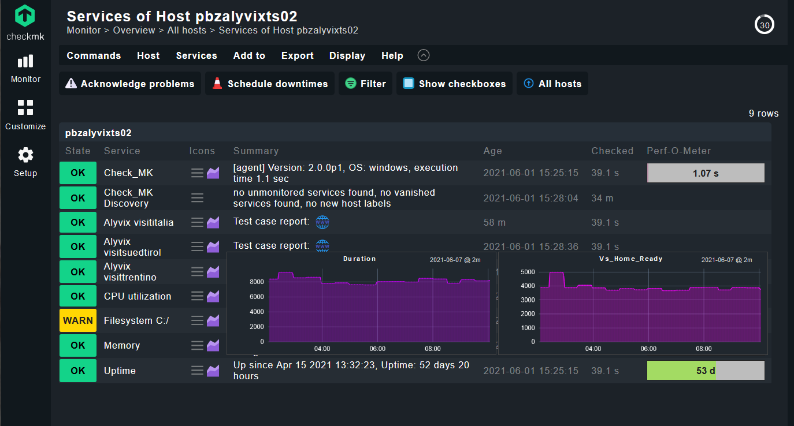

:author: Charles Callaway
:date: 03-06-2021
:modified: 07-06-2021
:tags: integration, monitoring
:lang: en-US
:translation: false
:status: updating

.. include:: ../sphinx-roles.txt

.. _monitoring_integrations_checkmk:

#####################
Checkmk 2 Integration
#####################

The procedure below will show you how to integrate Alyvix test cases into the Checkmk |trademark|
monitoring system.  When the configuration is completed, the Checkmk installation will request
the results of Alyvix runs at regular intervals via Alyvix Server's Measurements API, and the
data can then be visualized within a Checkmk Service View.

The configuration steps below assume you have (1) created Alyvix test cases readable by Alyvix
Robot that you want to monitor from your Alyvix Server located at :file:`server.alyvix.com,` and
(2) have a working Checkmk installation with that Alyvix Server already installed as a host.

Then the general outline of the configuration steps to complete is:

* Prepare the Checkmk
  `special agent <https://docs.checkmk.com/latest/en/datasource_programs.html#heading_specialagents>`_
  by installing the Python package that conducts the check locally on Alyvix Server
* Search for the Alyvix services and register them in Checkmk
* Verify that each Alyvix service was configured successfully

After these tasks are completed, your Checkmk dashboard will look like the following, with a
new Service entry for each Alyvix test case configured on Alyvix Server:

The following step-by-step guide illustrates the above steps in detail.

.. rst-class:: bignums

#. Install the Python package **on your Alyvix Server** to allow Checkmk to query the results of your
   test cases:

   * Download and extract the package files from the
     :iconlink:`ext|official repository|https://github.com/franzmelchiori/alyvix_server_checkmk`
     into the :file:`...\\Lib\\site-packages\\alyvix_server_checkmk\\` path of your
     Python installation.
   * Additionally, copy the file named :file:`agent_alyvix_server.bat` from that package into
     Checkmk's special agent directory on Alyvix Server at
     :file:`C:\\ProgramData\\checkmk\\agent\\local\\`

#. Optionally, you can run the local check command manually in a command prompt to ensure it works:

   .. code-block:: doscon
      :class: nocopy

      C:\ProgramData\checkmk\agent\local\> agent_alyvix_server.bat

      0 "Alyvix visitsuedtirol" duration=7246;;;;|vs_home_ready=3743;;;; ...
      0 "Alyvix visititalia" duration=6985;;;;|vi_home_ready=3411;;;; ...
      0 "Alyvix visittrentino" duration=8574;;;;|win_move=;;;;|vt_home_ready=1373;...

   If the output is similar to the above, then you have successfully completed steps #1 and #2.

#. Configure all Alyvix services automatically found by Checkmk so that the results of individual
   test cases can be visualized.

   * From the *Services View* of your Alyvix Server host in Checkmk, inside the **Host** menu
     at the top, select **Service configuration**, and then click on **Full service scan**.
     When it completes, you should see all new Alyvix services listed in the section
     "Undecided services (currently not monitored)".
   * For each Alyvix test case, click on the |chkmk-green-plus| icon labelled "Move to monitored
     services".  Those services will then be placed under the "Monitored services" section.
   * At the top right of the window, select the *Pending changes* action (it will say something
     like "3 changes").
   * At the top left select the "Activate on selected sites" action.

#. Add or (re)start a new test case on Alyvix Server so that test case results will be published
   by the Measurements API when Checkmk runs its local check command.

   Please refer to the documentation that describes these tasks:

   * See how to :ref:`add a new test case <session_management_test_cases>`
   * See how to :ref:`start an existing test case <test_case_flow_assignment>`

#. Check that the configuration was successful.

   From your Alyvix Server's *Services View*, you should see results of the first few checks:

   .. image:: images/chkmk-result-boxes.png
      :scale: 50%
      :alt: The three status boxes:  OK, warn and critical.

   If instead you see the service is still in a pending state (a gray box marked **PEND**), go to
   the row of the service, click on the 3-line icon menu (|bar-icon|) and select
   "Reschedule 'Checkmk' service".

   Once check results arrive, you can:

   * Hover over the graph icon to see a popup summary graph
   * Click on the graph icon to go to the dedicated, interactive results page
   * Click on the "blue globe" icon to see :ref:`the most recent report <transaction_reporting_top>`
     for that test case on Alyvix Server

That's it.  Congratulations on successfully setting up Alyvix Server and Checkmk to
visually monitor your test cases!

.. note::

   If you already have a complete, working installation with Checkmk and Alyvix Server, and you
   just need to add a new test case to your existing ones, then you only need to do steps #3
   through #5.

|
