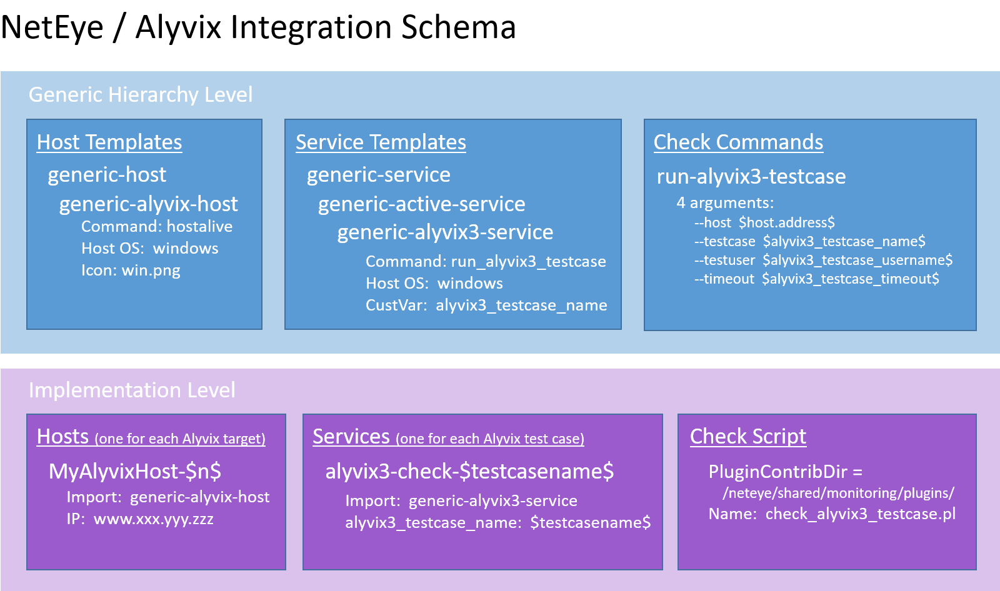

:author: Charles Callaway
:date: 04-05-2021
:modified: 04-05-2021
:tags: integration, monitoring
:lang: en-US
:translation: false
:status: updating

.. include:: ../sphinx-roles.txt

.. _monitoring_integrations_neteye:

####################
NetEye 4 Integration
####################

The procedure below will show you how to integrate Alyvix test cases into the NetEye |trademark|
monitoring system.  When the configuration is completed, the NetEye installation will request the
results of Alyvix runs at regular intervals via Alyvix Server's Measurements API, and the data can
then be visualized within
:iconlink:`ext|NetEye|https://www.wuerth-phoenix.com/en/solutions/it-system-management/unified-monitoring/`.

The configuration steps below assume you have created an Alyvix test case readable by Alyvix Robot
called :file:`myalyvixcheck.alyvix`, and you want to monitor it from Alyvix Server located on
:file:`server.alyvix.com`.

The general outline of the configuration steps to complete on the NetEye side is:

* Create and deploy the generic infrastructure:  **Host Templates**, **Service Templates**, custom
  variable fields and arguments, and a named Alyvix service for each Alyvix test case you intend
  to monitor (for instance, :file:`myalyvixcheck.alyvix`)
* Install the associated command script that queries Alyvix Server for monitoring results
* Create and deploy a host for each Alyvix Server you are running, and associate the named Alyvix
  services for each test case on each host
* Check that each host and service was configured successfully (both raw monitoring data and visualizations)

After these tasks are completed, your NetEye hierarchy will look like the following:

Although you can carry out these steps by hand, it's much easier to use NetEye's
*configuration baskets* to do as much of the work as possible for you.  The following step by step
guide provides the necessary steps in detail.

.. rst-class:: bignums

#. Open a (bash) shell to download and extract the
   :iconlink:`ext|NetEye GitHuB repository|https://github.com/zampat/neteye4/blob/master/doc/050_community_configs_init.md`
   by following the instructions in the "Installation and setup" section there.  (Use the **full**
   option with the second script.)

   If your NetEye already has the standardized configuration, skip running the first script
   (run_setup.sh).  Next, deploy the configuration to complete the setup:

   .. code-block::
      :class: short-code-block

      $ icingacli director config deploy

#. Copy the command check script for Alyvix in the repository to the contributed plugins directory:

   .. code-block::

      $ cp /tmp/ns/neteye4/monitoring/alyvix3-server/check_alyvix3_testcase.pl /neteye/shared/monitoring/plugins/

#. Within NetEye's Director, load the Alyvix configuration basket.  Note that you will be asked
   to load it from the operating system that your browser is located on, so you'll need to save the
   file locally.

   :download:`Alyvix3Basket.json`  |halftab|  (Alternatively:  :iconlink:`ext|Director-Basket_Alyvix3-Testcase.json|https://raw.githubusercontent.com/zampat/neteye4/master/monitoring/alyvix3-server/Director-Basket_Alyvix3-Testcase.json`)

   * Go to **Director > Configuration Baskets > Upload**, give the basket a name like
     "Alyvix3Basket", choose the file you just downloaded, and then press the "Upload' button
   * In the "Snapshots" tab that appears, click on the row at the bottom that lists which
     elements will be imported
   * Click on "Restore", and then also on the next "Restore" button
   * Deploy the new configuration at **Director > Activity log > Deploy pending changes**

#. We can now manually add a new host (one for each Alyvix Server instance).  From
   **Director > Host Objects > Hosts**, click on the **Add** action to open the new host
   form, fill in the details as below, and press the **Add** button.  When done, once again
   deploy the new configuration at **Director > Activity log > Deploy pending changes**.

   .. rst-class:: bignums
      :class: backmedbeige

   #. **Main properties**

      * Template = :file:`generic-alyvix3-host`
      * Hostname = :file:`server.alyvix.com`
      * Display name = :file:`Alyvix Server`
      * Host address = :file:`<IPAddr>`

   .. image:: images/neteye417-add-host.png
      :class: image-boxshadow zoomable-image-inset
      :alt: Screenshot showing how to add a host via a web form in NetEye.
      :target: ../_static/targets/neteye417-add-host.png

#. Next, manually create a new service for each test case.  Go to
   **Director > Monitored Services > Service Templates > generic-alyvix3-service** and select the
   action **Create a new Object inheriting from this template**.  Fill in the details below, then
   press the **Add** button at the bottom (the test case name in practice should match the name
   of your :file:`.alyvix` test case file on Alyvix Server).   You'll need to create a separate
   service for each test case you want to query from Alyvix Server, and then once again deploy
   the configuration.

   .. rst-class:: bignums
      :class: backmedbeige

   #. **Main properties**

      * Name = :file:`my-alyvix-check`
      * Host = :file:`server.alyvix.com`

   #. **Custom properties**

      * alyvix3_testcase_name = :file:`myalyvixcheck`

   .. image:: images/neteye417-add-service.png
      :class: image-boxshadow zoomable-image-inset
      :alt: Screenshot showing how to add a service via a web form in NetEye.
      :target: ../_static/targets/neteye417-add-service.png

#. To check that the configuration was successful, type your server name (**server.alyvix.com**)
   in the **Search** bar at the top of the page.  You should now see your new host and service in
   the **Tactical Overview**, along with their state (this will be annotated as **Pending** until
   the first checks are answered).  Click on the services icon to load the details panel on the
   right, and then on the name of one of the services.

   When the first results are available the **Plugin Output** section will change from
   being empty to containing a link named **Log** that points to the most recent report.
   The duration of the last full test case run will be shown in the **Performance data** section,
   along with the values of any test case objects whose measure flag is set, as long as their
   **warning** and **critical** fields were set to non-zero values.

   Under the **Performance Graph** section, clicking on the link "Open in Analytics Dashboard"
   loads the interactive graphs of each measure with their historical values.

   .. image:: images/neteye417-confirm-success.png
      :class: image-boxshadow zoomable-image
      :alt: Screenshot in NetEye showing the analytics graph for a host and service monitored via Alyvix Server.
      :target: ../_static/targets/neteye417-confirm-success.png

That's it.  Congratulations on successfully setting up Alyvix, Alyvix Server and NetEye to
visually monitor your test cases!

.. tip::

   Optionally, you can also create an Alyvix hostgroup (e.g. with **appliedgroup=windows_servers**
   or on the host template itself) to aggregate the results for all of your Alyvix servers and testcases.
   You can also create a dashlet on the main dashboard just by pointing it to this hostgroup.

|
