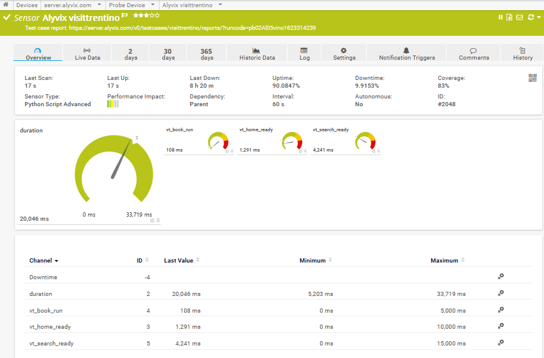

:author: Charles Callaway
:date: 03-06-2021
:modified: 07-06-2021
:tags: integration, monitoring
:lang: en-US
:translation: false
:status: updating

.. include:: ../sphinx-roles.txt

.. _monitoring_integrations_prtg:

#####################
|PRTGnet| Integration
#####################

This procedure shows how you can integrate Alyvix test cases into the |PRTG| |trademark|
monitoring system.  Once you've completed the configuration, your
:iconlink:`ext|PRTG|https://www.paessler.com/prtg/` installation will request
the results of Alyvix runs at regular intervals via Alyvix Server's Measurements API, and the
data can then be visualized and explored within |PRTG|.

The configuration steps below assume you have (1) created Alyvix test cases readable by Alyvix
Robot that you want to monitor from your Alyvix Server located at :file:`server.alyvix.com,` and
(2) have a working |PRTG| installation with that Alyvix Server already installed as a host.

Then the general outline of the configuration steps to complete is:

* Install a Python script that conducts a check locally on Alyvix Server
* Prepare a custom sensor within |PRTG| that will call that script
* Add the Alyvix service(s) by registering them as sensors in |PRTG|
* Verify that each Alyvix service was configured successfully

After these tasks are completed, you can explore your Alyvix test case results starting from
the |PRTG| dashboard and host views:

The following step-by-step guide illustrates the above steps in detail.

.. rst-class:: bignums

#. Install the Python script **on your Alyvix Server** to allow |PRTG| to query the results of your
   test cases:

   Download the Python local check script named :file:`sensor_alyvix_server.py` from the
   :iconlink:`ext|official repository|https://github.com/franzmelchiori/alyvix_server_prtg`
   into |PRTG|'s special agent directory on Alyvix Server at
   :file:`C:\\Program Files (x86)\\PRTG Network Monitor\\Custom Sensors\\python\\`

#. Start one or more test cases on Alyvix Server so that test case results will be published
   by the Measurements API when |PRTG| runs the local check command (PRTG cannot display any
   results if the Measurements API has no data).

   Please refer to the part of the Alyvix Server user guide that describes these tasks:

   * See how to :ref:`add a new test case <session_management_test_cases>`
   * See how to :ref:`start an existing test case <test_case_flow_assignment>`

#. Optionally, you can run the local check command manually in a command prompt to ensure it works:

   .. code-block:: doscon
      :class: nocopy

      C:\Program Files (x86)\PRTG Network Monitor\Custom Sensors\python\> sensor_alyvix_server.py -t visittrentino

      {"prtg": {"text": "Test case report: https://alyvix.server.com/v0/testcases/...", ...}}

   The output should be a JSON string similar to the above.

#. Create a :iconlink:`ext|Python Script Advanced Sensor|https://www.paessler.com/manuals/prtg/python_script_advanced_sensor`
   on the |PRTG| core server linked to the Python script on Alyvix Server:

   From the host view for Alyvix Server, select the blue **Add Sensor** action, then select the
   **Probe device** action.  When asked for the sensor type, use the search bar with the string
   "python", and select the **Python Script Advanced** sensor type.

   In the configuration box that appears, leave most of the default settings, but make sure the
   **Python Script** field says :file:`sensor_alyvix_server.py` and the **Additional Parameters**
   field contains the name of your test case (you'll have to add one sensor for each Alyvix test
   case you plan to include in your services view).  Click on the blue **Create** action when done.

   .. image:: images/prtg21-add-python-sensor.png
      :class: image-boxshadow zoomable-image-inset
      :width: 90%
      :align: center
      :alt: A screenshot that lets you create settings for a custom Python sensor.
      :target: ../_static/targets/prtg21-add-python-sensor.png

   |

#. Check that the configuration was successful.

   From the *Services View* of your Alyvix Server host in |PRTG|, you should see results of the
   first few checks (remember that results won't be available until the test case has run at
   least one time):

   .. image:: images/prtg21-final-result.png
      :class: image-boxshadow zoomable-image-inset
      :width: 90%
      :align: center
      :alt: A screenshot that shows the result after configuration is complete.
      :target: ../_static/targets/prtg21-integration.png

   If instead you see the service is still in a pending state (a gray box marked :greyblock:`?`),
   reload the page every so often until the results appear.  Once the check results are visible,
   you can:

   * Click on the graph icon to go to the dedicated, interactive results page (graph and sortable table)
   * Copy and paste the URL (located at the top of the page) for
     :ref:`the most recent report <transaction_reporting_top>` for that test case on Alyvix Server

   .. image:: images/prtg21-view-graph.png
      :class: image-boxshadow zoomable-image-inset
      :width: 90%
      :align: center
      :alt: A screenshot that shows the result after configuration is complete.
      :target: ../_static/targets/prtg21-view-graph.png

You're done.  Congratulations on successfully setting up Alyvix Server and |PRTG| to
visually monitor your test cases!

.. note::

   If you already have a complete, working installation with |PRTG| and Alyvix Server, and you
   just need to add a new test case to your existing ones, then you only need to carry out steps #4
   and #5.

|
