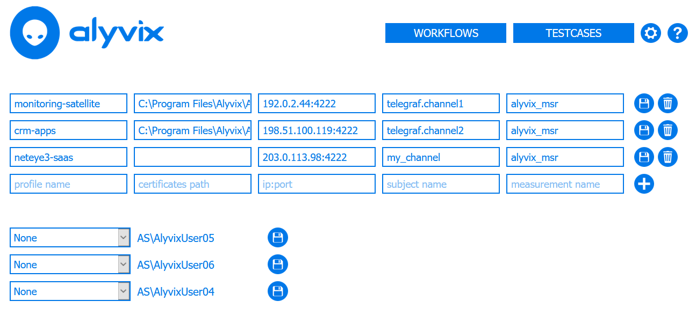

:author: Charles Callaway
:date: 22-09-2020
:modified: 05-11-2020
:tags: index
:lang: en-US
:translation: false
:status: final

.. include:: sphinx-roles.txt

.. _session_management_top:

==================
Session Management
==================

A session is the connection between Alyvix Server and a Windows session you want to run Alyvix
test cases on.  Alyvix Server can manage multiple sessions for you, allowing you to define what
you want to achieve and letting Alyvix Server take care of the details.  That's what we mean by
scaling up -- adding a lot more sessions doesn't mean you have to spend a lot more of your time.

.. _session_management_settings:

***************************
Session Management Settings
***************************

Assuming you've already created test cases with Alyvix Editor, when you first use Alyvix Server
you'll need to configure some basic settings.

The session management settings are global parameters governing all Alyvix test case sessions run
on a specific Alyvix Server (that is, a single IP address).  You can view or edit them by clicking
on the gear icon |gear-icon| at the top right, or going to the following endpoint in a browser on
your **private network**:

.. table::
   :class: tablecell-endpoint large-font-size
   :widths: 5 95

   +------------------------------------------------------+
   | :lfs:`Session Management Endpoint`                   |
   +-----+------------------------------------------------+
   | :lfs:`Endpoint:`                                     |
   +-----+------------------------------------------------+
   |     | :ep-red:`https://<alyvix_server>/settings`     |
   +-----+------------------------------------------------+
   | :lfs:`Example:`                                      |
   +-----+------------------------------------------------+
   |     | :ep-black:`https://localhost/settings`         |
   +-----+------------------------------------------------+

These global test case settings are:

* **Test Case Path:**  A Windows-format absolute or relative path
  (e.g., :file:`C:\\Alyvix\\Testcases\\`) that points to a directory containing all of the
  Alyvix 3 test cases that can be run by this instance of Alyvix Server.  If you add or update
  any test cases, or change this path, Alyvix Server will automatically and immediately pick up
  those changes.
* **Private Key:**  A cleartext private key that Alyvix Robot can use to decrypt any encrypted
  keys you have stored in an Alyvix test case when you created it.
* **Scheduling Period [s]:**  The length of time in seconds until Alyvix Server will restart the
  *flow* assigned to a particular session.  The scheduling period is the same across all sessions
  on a given Alyvix Server.
* **Retention Period Success [d]:**  The number of days that successful test case runs will be
  stored and `available for immediate inspection <transaction_reporting.html>`_.
* **Retention Period Failure [d]:**  The number of days that failed test case runs will be
  stored.

The *Settings* interface allows you to modify global settings as well as settings for individual
sessions:

.. image:: images/settings03.png
   :class: image-boxshadow zoomable-image image-very-large
   :alt: The settings interface.
   :target: ../_static/targets/settings03.png

.. _session_management_session_description:

To set the values for any of these settings, go to the endpoint above, enter the new value in the
appropriate field, and press the save icon |save-icon| to the right of the change you made.

The endpoint above also contains the settings for individual sessions:

* **Domain and Username:**  The Windows domain and login name that are needed to log in and keep
  alive a session on the server.
* **Password:**  The corresponding password.
* **Resolution\@scaling factor:**  The screen resolution and scaling/zoom factor (e.g.,
  1280*800\@100Hz) of the RDC window that will host the session.  All test cases in the session's
  flow should contain test case objects that include the resolution and factor set here.

To update these values, go to the endpoint above, enter the new value in the appropriate field,
and press the |save-icon| save icon.  The trash can icon |trash-icon| will remove the corresponding
session (the entire row), while the plus icon |plus-icon| will insert a row for a new session.

.. _session_management_test_cases:

***************************
Managing Session Test Cases
***************************

Test cases in the :ref:`specified test case directory <session_management_settings>` can be added
to any session on the Alyvix Server containing them.  However, just because a test case is stored
in that directory doesn't mean that it will be scheduled.  It must first be added to the test case
table by configuring it via the following endpoint:

.. table::
   :class: tablecell-endpoint large-font-size
   :widths: 5 95

   +-------------------------------------------------------------+
   | :lfs:`Session Test Case Endpoint`                           |
   +-----+-------------------------------------------------------+
   | :lfs:`Endpoint:`                                            |
   +-----+-------------------------------------------------------+
   |     |:ep-red:`https://<alyvix_server>/testcases`            |
   +-----+-------------------------------------------------------+
   | :lfs:`Example:`                                             |
   +-----+-------------------------------------------------------+
   |     | :ep-black:`https://localhost/testcases`               |
   +-----+-------------------------------------------------------+

Each test case can also appear multiple times in the test case table, including with different
arguments to pass to Alyvix Robot.  The first three settings create the schedulable test case
configuration:

* **Test Case Name:**  The file name of a test case, which is located in the test case directory.
* **Arguments:**  Arguments that can be passed to Alyvix Robot when executing a test case, such
  as via the CLI, with values separated by commas.
* **Alias:**  The name of the schedulable test case configuration.  While this can be any string
  you choose (unique with respect to other test case aliases), combining the test case name and
  an argument, or just the test case name alone, can aid understanding of dashboards and reports.

.. image:: images/testcases02.png
   :class: image-boxshadow zoomable-image image-very-large
   :alt: The test case interface.
   :target: ../_static/targets/testcases02.png

The two *screenshot settings* on the right side allow you to configure:

  * **Screen Recording:**

    * **Any Output:**  Take a screenshot once for each test case object.
    * **Broken Output Only:**  Take a screenshot only when a test case object fails.
    * **None:**  Never take a screenshot.

  * **Screen Compression:**

    * **Lossless:**  Keep the original screenshot without compressing it.
    * **Compressed:**  Compress all screenshots for this schedulable test case configuration.

The up and down icons |sort-down-icon| |sort-up-icon| allow you to change the order that the
test cases will run in (echoed in the :ref:`workflow table <test_case_flow_assignment>`).  The
trash can icon |trash-icon| will remove an existing test case configuration (the entire row),
while the plus icon |plus-icon| will insert a row for a new session.  In the current version of
Alyvix Server, you cannot modify an existing configuration; you will need to remove the row
in question and re-add it.

.. _session_management_nats:

**************************
NATS and InfluxDB Settings
**************************

Besides configuring the session settings of a particular server via its IP address, you can
also set them to forward the data to a NATS server and a particular InfluxDB data table, allowing
you to view the data in Grafana.  Forwarding data to NATS is complementary -- Alyvix Server will
still continue to receive data, and it will still be visible via the measurement API.

For this feature, you will need to configure communication parameters via the NATS/InfluxDB endpoint:

.. table::
   :class: tablecell-endpoint large-font-size
   :widths: 5 95

   +--------------------------------------------------------+
   | :lfs:`NATS/InfluxDB Management Endpoint`               |
   +----+---------------------------------------------------+
   | :lfs:`Endpoint:`                                       |
   +----+---------------------------------------------------+
   |    | :ep-red:`https://<alyvix_server>/nats-influxdb`   |
   +----+---------------------------------------------------+
   | :lfs:`Example:`                                        |
   +----+---------------------------------------------------+
   |    | :ep-black:`https://localhost/nats-influxdb`       |
   +----+---------------------------------------------------+

For each NATS instance you want to connect, you will need to fill in the following fields:

* **Profile Name:**  A unique name for a new NATS connection instance that you will then be able
  to assign to a given session at the bottom of the page.
* **Certificates Path:**  If you use TLS encryption, this will point to the directory containing
  your :file:`*.ca.crt` certificate authority file, :file:`*.crt` public key file, and
  :file:`*.key` (not encrypted) private key file.  If you leave this field blank, encryption via
  TLS will be disabled, and data will be sent in cleartext.
* **IP/Port:**  The address of the NATS server.
* **Subject Name:**  The InfluxDB database name to use.
* **Measurement Name:**  The name of the measurements table within your InfluxDB subject where the
  data should be stored when it arrives.

Once you add a NATS configurations at the top, you can assign it to one or more existing sessions.
Each session can stream to at most one NATS-InfluxDB channel, although multiple sessions can send
data to a single NATS-InfluxDB channel.

|
