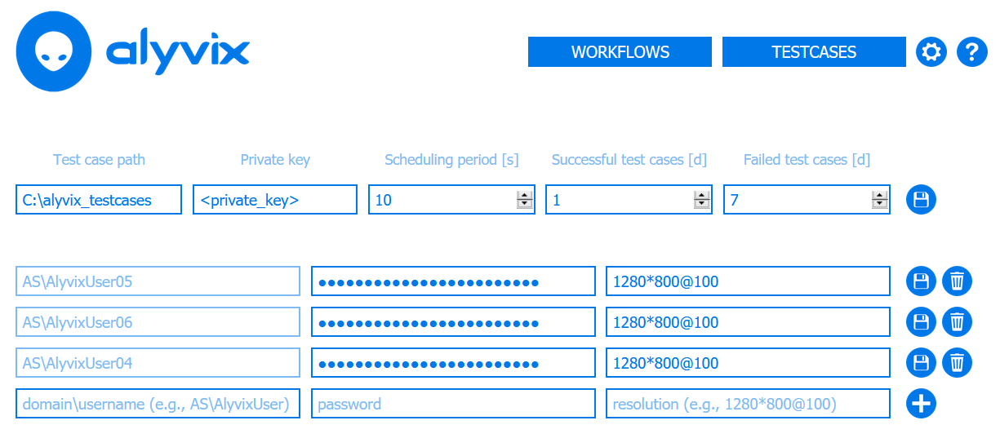
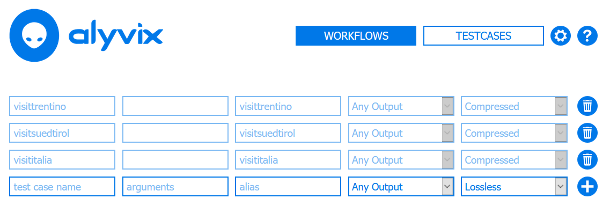

:author: Charles Callaway
:date: 22-09-2020
:modified: 05-11-2020
:tags: index
:lang: en-US
:translation: false
:status: final

.. include:: sphinx-roles.txt

.. _session_management_top:

==================
Session Management
==================

A session is the connection between Alyvix Server and a Windows session you want to run Alyvix
test cases on.  Alyvix Server can manage multiple sessions for you, allowing you to define what
you want to achieve and letting Alyvix Server take care of the details.  That's what we mean by
scaling up -- adding a lot more sessions doesn't mean you have to spend a lot more of your time.

.. _session_management_settings:

***************************
Session Management Settings
***************************

Assuming you've already created test cases with Alyvix Editor, when you first use Alyvix Server
you'll need to configure some basic settings.

The session management settings are global parameters governing all Alyvix test case sessions run
on a specific Alyvix Server (that is, a single IP address).  You can view or edit them by going
to the following endpoint in a browser on your private network:

.. table::
   :class: tablecell-endpoint

   +----------------------------------------------------+
   | Session Management Endpoint                        |
   +-----------+----------------------------------------+
   | Endpoint: | :bolditalic:`https://<alyvix_server>/` |
   +-----------+----------------------------------------+
   | Example:  | :bolditalic:`https://localhost/`       |
   +-----------+----------------------------------------+

These global test case settings are:

* **Test Case Path:** A Windows-format absolute or relative path
  (e.g., :file:`C:\\Alyvix\\Testcases\\`) that points to a directory containing all of the
  Alyvix 3 test cases that can be run by this instance of Alyvix Server.  If you add or update
  any test cases, or change this path, Alyvix Server will automatically and immediately pick up
  those changes.
* **Private Key:**  A cleartext private key that Alyvix Robot can use to decrypt any encrypted
  keys you have stored in an Alyvix test case when you created it.
* **Scheduling Period [s]:**  The length of time in seconds until Alyvix Server will restart the
  *flow* assigned to a particular session.  The scheduling period is the same across all sessions
  on a given Alyvix Server.
* **Retention Period Success [d]:**  The number of days that successful test case runs will be
  stored and :ref:`available for immediate inspection <transaction_reporting_top>`.
* **Retention Period Failure [d]:**  The number of days that failed test case runs will be
  stored.

The *Settings* interface allows you to modify global settings as well as settings for individual
sessions:

.. _session_management_session_description:

To set the values for any of these settings, go to the endpoint above, enter the new value in the
appropriate field, and press the :guilabel:`Save` icon to the right of the change you made.

The endpoint above also contains the settings for individual sessions:

* **Domain and Username:**  The Windows domain and login name that are needed to log in and keep
  alive a session on the server.
* **Password:**  The corresponding password.
* **Resolution\@scaling factor:**  The screen resolution and scaling/zoom factor (e.g.,
  1280*800\@100Hz) of the RDC window that will host the session.  All test cases in the session's
  flow should contain test case objects that include the resolution and factor set here.

To update these values, go to the endpoint above, enter the new value in the appropriate field,
and press the :guilabel:`Save` icon.  The :guilabel:`Trash can` icon will remove an existing
session (the entire row), while the :guilabel:`Plus` icon will insert a row for a new session.

.. _session_management_test_cases:

***************************
Managing Session Test Cases
***************************

Test cases in the :ref:`specified test case directory <session_management_settings>` can be added
to any session on the Alyvix Server containing them.  However, just because a test case is stored
in that directory doesn't mean that it will be scheduled.  It must first be added to the test case
table by configuring it via the following endpoint:

.. table::
   :class: tablecell-endpoint

   +-------------------------------------------------------------+
   | Session Test Case Endpoint                                  |
   +-----------+-------------------------------------------------+
   | Endpoint: | :bolditalic:`https://<alyvix_server>/testcases` |
   +-----------+-------------------------------------------------+
   | Example:  | :bolditalic:`https://localhost/testcases`       |
   +-----------+-------------------------------------------------+

Each test case can also appear multiple times in the test case table, including with different
arguments to pass to Alyvix Robot.  The first three settings create the schedulable test case
configuration:

* **Name:**  The file name of a test case, which is located in the test case directory.
* **Arguments:**  Arguments that can be passed to Alyvix Robot when executing a test case, such
  as via the CLI, with values separated by commas.
* **Alias:**  The name of the schedulable test case configuration.  While this can be any string
  you choose (unique with respect to other test case aliases), combining the test case name and
  an argument, or just the test case name alone, can aid understanding of dashboards and reports.

The two *screenshot settings* on the right side allow you to configure:

  * **Screen Recording:**

    * **Any Output:**  Take a screenshot once for each test case object.
    * **Broken Output Only:**  Take a screenshot only when a test case object fails.
    * **None:**  Never take a screenshot.

  * **Screen Compression:**

    * **Lossless:**  Keep the original screenshot without compressing it.
    * **Compressed:**  Compress all screenshots for this schedulable test case configuration.

The :guilabel:`Trash can` icon will remove an existing test case configuration (the entire row),
while the :guilabel:`Plus` icon will insert a row for a new session.  In the current version of
Alyvix Server, you cannot modify an existing configuration; you will need to remove the row in
question and re-add it.

|
