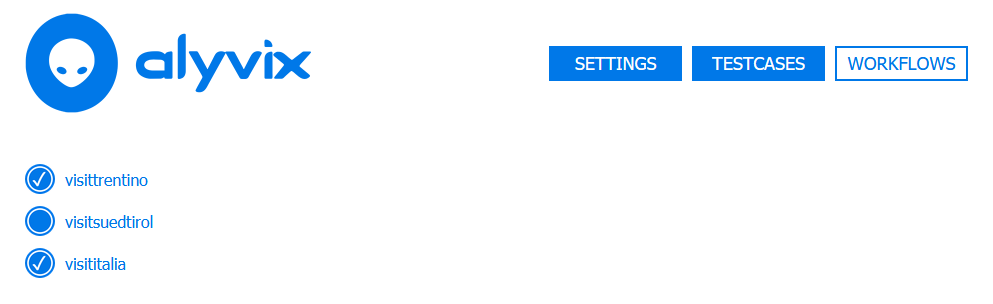
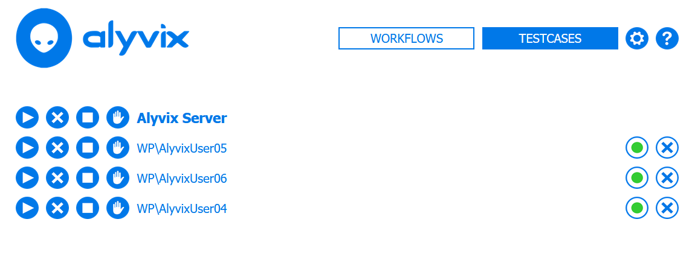

:author: Charles Callaway
:date: 22-09-2020
:modified: 05-11-2020
:tags: index
:lang: en-US
:translation: false
:status: final

.. include:: sphinx-roles.txt

.. _test_case_scheduling_top:

====================
Test Case Scheduling
====================

Alyvix Server provides a basic scheduler that takes the flows you have configured, and starts
them at regular intervals on the sessions you assigned them to.

There are three main concepts to understand:

* **Session Workflows:**  A *flow* is a set of Alyvix test case aliases that are assigned to a
  session, drawn from the available test case aliases, which in turn are drawn from the Alyvix
  test cases whose files can be found in the global configured
  :ref:`Test Case Path <session_management_settings>`.
* **Scheduling Period:**  The length of time in seconds until Alyvix Server will try to run the
  next test case alias of the *flow* assigned to a particular session.  Once all of the test cases
  in the flow have completed, the scheduler will restart that flow from the beginning.
* **Session State:**  An Alyvix Server session can be in one of these two states:

  * **Ready:**  The scheduler is waiting to initiate a new test case alias
  * **Busy:**  A test case alias is currently running in the configured session

.. comment

   You can control how Server transitions between these states with the controls described below.

   .. image:: pictures/server-scheduler.png
      :class: image-boxshadow
      :alt: Alyvix Server Scheduler
      :target: https://youtu.be/rC_bjgXCcZ4

   In the diagram above, the horizontal rows represent the session workflows, the scheduling period
   is the distance between any two of the "flags", and the session state is indicated by the flag
   itself, with red indicating "busy" and green indicating "ready".  A test case is run whenever
   a scheduling period begins (green flag), and at least one test case alias in the workflow has not
   yet run during that period.  :warn:`This doesn't sound right.`

.. _test_case_flow_assignment:

*************************
Test Case Flow Assignment
*************************

After you have defined the session and test case configurations, you can begin to assign individual
Alyvix test case aliases to a particular session.  Once defined, you can then initiate the execution
of test cases as described in the Test Case Flow Management section below.

.. table::
   :class: tablecell-endpoint

   +------------------------------------------------------------------------------------------+
   | Flow / Test Case Assignment Endpoint                                                     |
   +-----------+------------------------------------------------------------------------------+
   | Endpoint: | :bolditalic:`https://<alyvix_server>/workflow?username=<domain>\\<username>` |
   +-----------+------------------------------------------------------------------------------+
   | Example:  | :bolditalic:`https://localhost/workflow?username=MS\\johnsmith`              |
   +-----------+------------------------------------------------------------------------------+

In addition to using the endpoint above directly, you can use the flow management interface to
arrive at the workflow assignment interface here, which allows you to determine which aliases
will be included by simply ticking the checkbox for each alias (within a flow, test case aliases
are displayed and run in the order they were entered).

.. _test_case_flow_management:

*************************
Test Case Flow Management
*************************

The Management interface allows you to change the state of workflows, and can be accessed from
the following endpoint:

.. table::
   :class: tablecell-endpoint

   +-------------------------------------------------------------+
   | Flow Management Endpoint                                    |
   +-----------+-------------------------------------------------+
   | Endpoint: | :bolditalic:`https://<alyvix_server>/workflows` |
   +-----------+-------------------------------------------------+
   | Example:  | :bolditalic:`https://localhost/workflows`       |
   +-----------+-------------------------------------------------+

The Flow interface shown here displays the global controls for all available sessions on the
current server on the first line, followed by a separate row for each individual session.  Once a
flow has at least one assigned test case alias, it is available for scheduling.

The main controls shown at the left allow you to manage the session state:

.. _test_case_flow_management_actions:

* **Run:**  Start the session using the scheduler, which will automatically execute the session's
  assigned flow
* **Break:**  Force the currently running test case of a session to immediately proceed to its
  fail/exit section, then halt the scheduler until further action is taken
* **Stop:**  Force the currently running test case of a session to immediately stop without running
  either its fail or exit sections, then halt the scheduler until further action is taken
* **Manual:**  Stop the scheduler at the end of the current flow execution, then permit manual
  scheduling by inserting an endpoint URL specifying the flow name into the browser's address bar
  (automated scheduling can be restarted with the *Run* action):

  .. table::
     :class: tablecell-endpoint

     +----------------------------------------------------------------------------------------------+
     | Manual Scheduling Endpoint                                                                   |
     +-----------+----------------------------------------------------------------------------------+
     | Endpoint: | :bolditalic:`https://<alyvix_server>/v0/flows/run?username=<domain>\\<username>` |
     +-----------+----------------------------------------------------------------------------------+
     | Example:  | :bolditalic:`https://localhost/v0/flows/run?username=MS\\johnsmith`              |
     +-----------+----------------------------------------------------------------------------------+

The other elements in each row are:

* **Domain and Username:**  The name of the session, as defined on the
  :ref:`session management page <session_management_session_description>`.  Clicking on this
  element takes you to the flow assignment page, allowing you to define the sequence of Alyvix
  test case aliases that the scheduler will run for this session (see the preceding section).
* **Flow state:**  How that flow is currently executing (running or not running)
* **Session state:**  How the session is set to progress, as managed by a user action below

|

