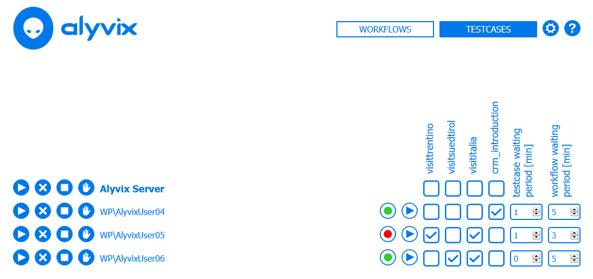

:author: Charles Callaway
:date: 22-09-2020
:modified: 05-11-2020
:tags: index
:lang: en-US
:translation: false
:status: final

.. include:: sphinx-roles.txt

.. _test_case_scheduling_top:

====================
Test Case Scheduling
====================

Alyvix Server provides a scheduler that takes the flows you have configured, and starts
them at regular intervals on the sessions you assigned them to.

There are three main concepts to understand:

* **Session Workflows:**  A *flow* is a set of Alyvix test case aliases that are assigned to a
  session, drawn from the available test case aliases, which in turn are drawn from the Alyvix
  test cases whose files can be found in the global configured
  :ref:`Test Case Path <session_management_settings>`.
* **Scheduling Period:**  The length of time in seconds until Alyvix Server will try to run the
  next test case alias of the *flow* assigned to a particular session.  Once all of the test cases
  in the flow have completed, the scheduler will restart that flow from the beginning after the
  waiting period (see below) has elapsed.
* **Session State:**  An Alyvix Server session can be in one of these two states:

  * **Ready:**  The scheduler is waiting to initiate a new test case alias
  * **Busy:**  A test case alias is currently running in the configured session

.. comment

   You can control how Server transitions between these states with the controls described below.

   .. image:: pictures/server-scheduler.png
      :class: image-boxshadow
      :alt: Alyvix Server Scheduler
      :target: https://youtu.be/rC_bjgXCcZ4

   In the diagram above, the horizontal rows represent the session workflows, the scheduling period
   is the distance between any two of the "flags", and the session state is indicated by the flag
   itself, with red indicating "busy" and green indicating "ready".  A test case is run whenever
   a scheduling period begins (green flag), and at least one test case alias in the workflow has not
   yet run during that period.  :warn:`This doesn't sound right.`

.. _test_case_flow_assignment:

*************************
Test Case Flow Assignment
*************************

After you have defined the :ref:`session <session_management_settings>` and
:ref:`test case configurations <session_management_session_description>`, you can begin to
assign individual Alyvix test case aliases to a particular session.  Once defined, you can
then initiate the execution of test cases as described below.

.. table::
   :class: tablecell-endpoint

   +----------------------------------------------------+
   | Flow Management Endpoint                           |
   +-----------+----------------------------------------+
   | Endpoint: | :bolditalic:`https://<alyvix_server>/` |
   +-----------+----------------------------------------+
   | Example:  | :bolditalic:`https://localhost/`       |
   +-----------+----------------------------------------+

In addition to using the endpoint above directly, you can click on the :guilabel:`Workflows`
button at the top right of the interface to see the workflow screen shown here.

The Flow interface shows the global controls for all available sessions on the
current server on the first line, followed by a separate row for each individual session.
Once a flow has at least one assigned test case alias, it is available for scheduling.

The main controls shown at the left allow you to manage the session state:

.. _test_case_flow_management_actions:

* |play-icon| **Run:**  Start the session using the scheduler, which will automatically execute
  the session's assigned flow
* |times-icon| **Break:**  Force the currently running test case of a session to immediately
  proceed to its   fail/exit section, then halt the scheduler until further action is taken,
  completely flushing and cleaning all pending execution sequences
* |stop-icon| **Stop:**  Force the currently running test case of a session to immediately stop
  without
  running either its fail or exit sections, then halt the scheduler until further action is
  taken, completely flushing and cleaning all pending execution sequences
* **Manual:**  Stop the scheduler at the end of the current flow execution, then
  permit manual scheduling by inserting an endpoint URL specifying the flow name into the
  browser's address bar (automated scheduling can be restarted with the *Run* action):

  .. table::
     :class: tablecell-endpoint

     +----------------------------------------------------------------------------------------------+
     | Manual Scheduling Endpoint                                                                   |
     +-----------+----------------------------------------------------------------------------------+
     | Endpoint: | :bolditalic:`https://<alyvix_server>/v0/flows/run?username=<domain>\\<username>` |
     +-----------+----------------------------------------------------------------------------------+
     | Example:  | :bolditalic:`https://localhost/v0/flows/run?username=MS\\johnsmith`              |
     +-----------+----------------------------------------------------------------------------------+

The non-interactive elements in the middle of each row are:

* **Domain and Username:**  The name of the session, as defined on the
  :ref:`session management page <session_management_session_description>`.
* **Flow state:**  This traffic light icon depicts how that flow is currently executing, red
  when the corresponding Alyvix bot is operating in a session, and green during a Waiting
  Period (see below)
* **Session state:**  The icon here depicts how the session is set to progress, as managed
  by the actions at the left of the screen

The controls on the right side let you assign test cases to a workflow, and manage the idle
waiting time between both individual test cases in a single workflow and between subsequent
runs of a full workflow.  The waiting periods work together with the scheduling period (see
above) to determine when the next test case actually runs.

To assign test cases to a workflow, simply tick the checkbox for each configured test case
alias.  The order will proceed from left to right, but you can change the relative ordering
of the various test case aliases using the :ref:` <session_management_test_cases>`.

To change the length of the waiting periods, simply increase or decrease the number either
by editing the text field or using the arrow controls.  They are defined as follows:

* **Test Case Waiting Period:**  The number of minutes to wait before trying to schedule the
  next test case within the current workflow.
* **Workflow Waiting Period:**  The number of minutes to wait before restarting the current
  workflow again from the beginning after its last test case has exited.

|

