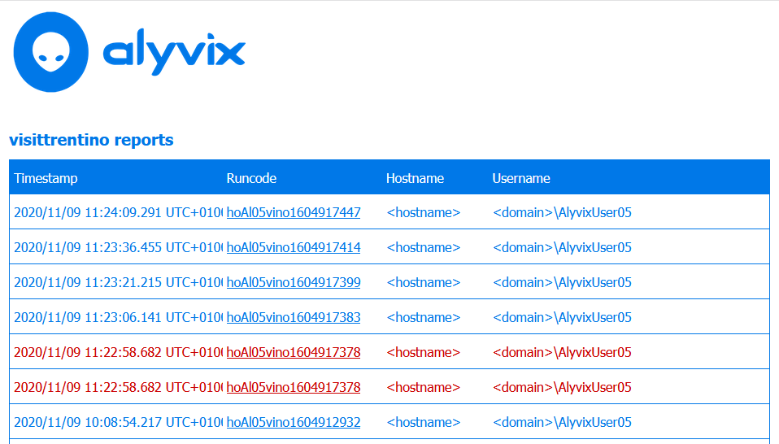
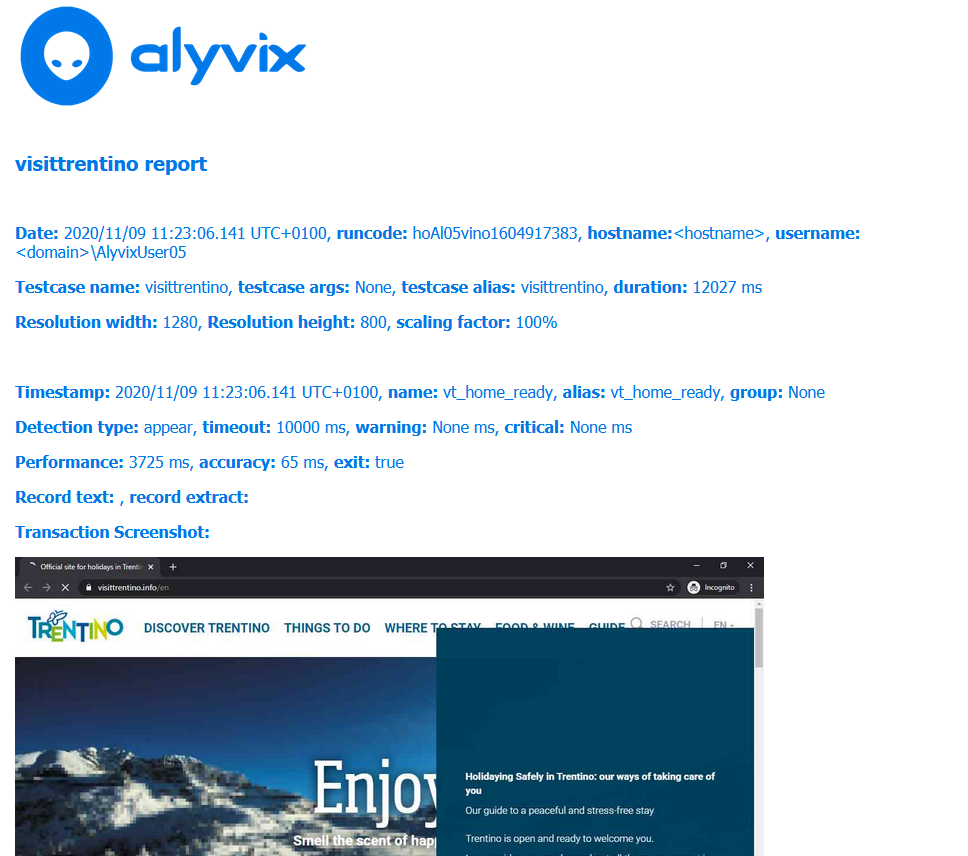

:author: Charles Callaway
:date: 22-09-2020
:modified: 05-11-2020
:tags: index
:lang: en-US
:translation: false
:status: final

.. include:: sphinx-roles.txt

.. _transaction_reporting_top:

=====================
Transaction Reporting
=====================

Once your test cases are running, they will begin to generate logs and data, which are the
results that you will want to view or send to a monitoring system.  The human readable reports
in HTML are available from the Report Listing endpoint:

.. table::
   :class: tablecell-endpoint large-font-size
   :widths: 2 98

   +----------------------------------------------------------------------------+
   | :lfs:`Report Listing Endpoint`                                             |
   +----+-----------------------------------------------------------------------+
   | :lfs:`Endpoint:`                                                           |
   +----+-----------------------------------------------------------------------+
   |    | :ep-red-med:`https://<alyvix_server>/<API>/testcases/<alias>/reports` |
   +----+-----------------------------------------------------------------------+
   | :lfs:`Example:`                                                            |
   +----+-----------------------------------------------------------------------+
   |    | :ep-black-med:`https://localhost/v0/testcases/shipping_w1/reports`    |
   +----+-----------------------------------------------------------------------+

The resulting interface displays a list of all recent runs of a given test case alias in reverse
chronological order, with the following information for each run:

* **Timestamp:**  The moment when that test case was launched, internally expressed as a Unix Epoch
* **Runcode:**  A unique code that identifies a particular run of a particular alisas on a particular host
* **Hostname:**  The server or virtual machine that the test case was run on
* **Username:**  The domain and username under which the session was opened

The reports listing contains a fixed number of rows per page, and can be advanced by using the
controls at the bottom.  All reports are available until they have exceeded
:ref:`the retention period set <session_management_settings>` for the session under which
they launched (remember that you can set the retention period separately for successful versus
failed runs).

Each row contains a link to the detailed report in the **Runcode** column, which serves as the
index.  Rows marked in red indicate test cases that failed.  To obtain the detailed report of a
specific run, you can either click on the link, or use the Report Details endpoint directly by
inserting that same *runcode* into the following endpoint URL:

.. table::
   :class: tablecell-endpoint large-font-size
   :widths: 2 98

   +----------------------------------------------------------------------------------------------------------+
   | :lfs:`Report Details Endpoint`                                                                           |
   +----+-----------------------------------------------------------------------------------------------------+
   | :lfs:`Endpoint:`                                                                                         |
   +----+-----------------------------------------------------------------------------------------------------+
   |    | :ep-red-med:`https://<alyvix_server>/<API>/testcases/<alias>/reports/?runcode=<runcode>`            |
   +----+-----------------------------------------------------------------------------------------------------+
   | :lfs:`Example:`                                                                                          |
   +----+-----------------------------------------------------------------------------------------------------+
   |    | :ep-black-med:`https://localhost/v0/testcases/shipping_w1/reports/?runcode=pb01Al01vino1601287294`  |
   +----+-----------------------------------------------------------------------------------------------------+

The resulting detailed report:

* Shows the full global settings in effect when the test was run
* For each test case object in the Alyvix test case, in the order in which it was executed,
  displays the corresponding parameters, timing results, and screenshot taken at the moment
  that either a match occurred or failed.

The screenshots especially serve as a quick visual verification of whether or not the application
or website was in fact working properly when the test case was run.  In the event that a test case
object failed to match, the screenshot will be annotated to indicate the point of failure.

|
