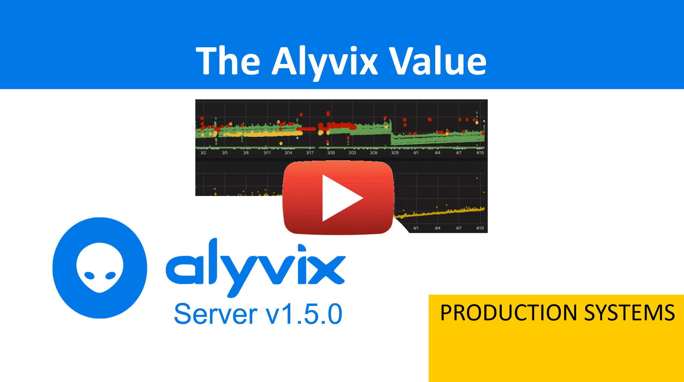
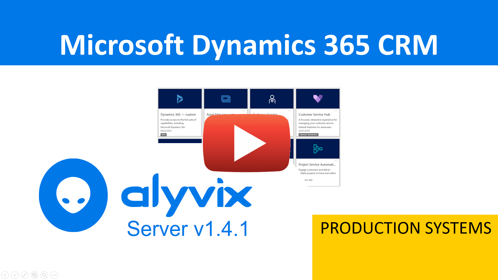
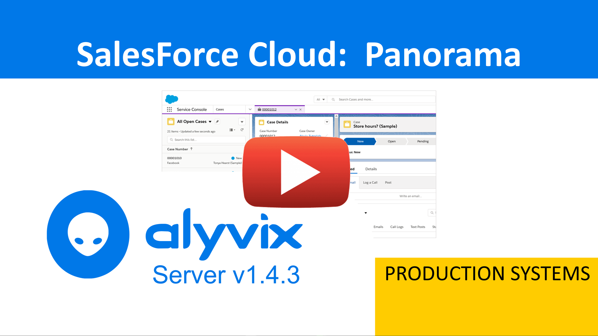

:author: Charles Callaway
:date: 27-07-2021
:modified: 27-07-2021
:tags: videos, tutorials
:lang: en-US
:translation: false
:status: draft

.. include:: sphinx-roles.txt

.. _video_tutorials_top:

###############
Video Tutorials
###############

The Alyvix Server video tutorials below can provide a more active introduction to
.

.. _server_tutorial_intro_120:

.. rubric:: Alyvix Server Introduction

See a brief, high level overview that shows you how to configure and run Alyvix Server.

|source-youtube|

|

.. _server_tutorial_alyvix_value:

.. rubric:: The Alyvix Value

This video shows how you can integrate Alyvix Server to visualize test case results using
graph-based systems like Grafana to explore long-term data to find trends and isolate problems.
This video shows you the true value that Alyvix Server can deliver to your organization.

|source-youtube|

|

.. _server_tutorial_dynamics_crm:

.. rubric:: Microsoft Dynamics 365 CRM

See how to use a configured instance of Alyvix Server to schedule your Alyvix test cases for
Microsoft Dynamics 365 (CRM module) via Alyvix Robot, view the results from the Measurements
API, and see generated reports in HTML of both successful and failed tests cases that provide
exquisite detail.

|source-youtube|

|

.. _server_tutorial_sales_force:

.. rubric:: Sales Force Cloud

This video is structured identically to the one above, but shows how to run a test case based
on Sales Force's Cloud (Lightning edition) CRM tool.

|source-youtube|

|

